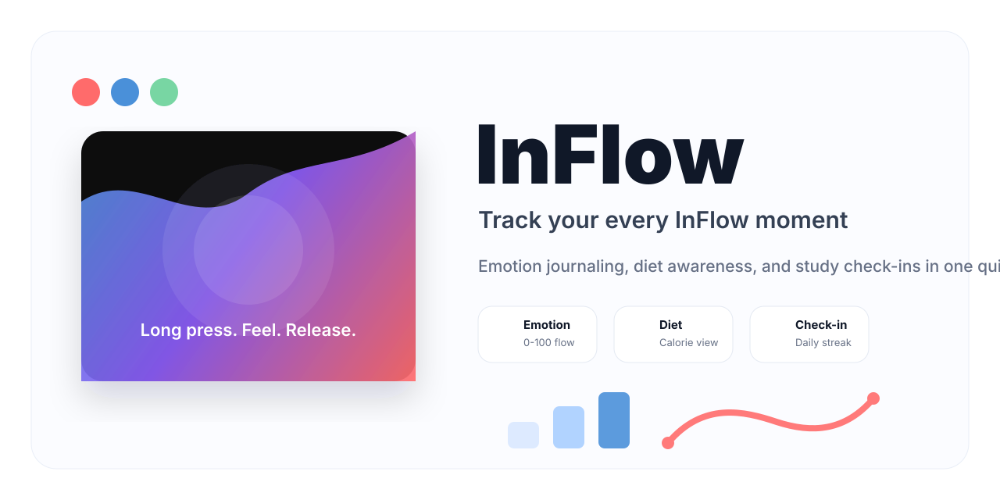
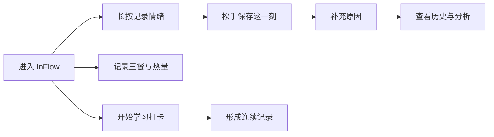

<p align="center">
  
</p>

<h1 align="center">InFlow</h1>

<p align="center">
  <strong>Track your every InFlow moment</strong>
</p>

<p align="center">
  
  
  
  
</p>

## 项目简介

InFlow 是一款关注个人状态流动的前端交互应用。它把情绪、饮食、学习打卡这些每天都会发生的小片段，整理成一条可以被记录、观察和回看的个人 InFlow。

应用的核心体验很简单：长按按钮，感受当下；松开按钮，把这一刻保存下来。情绪强度会被转换成分数、Emoji、粒子动画和历史曲线，让原本很难描述的状态变得可见、可追踪。

## 核心体验

| 功能 | 你可以做什么 | 体验亮点 |
| --- | --- | --- |
| 情绪记录 | 通过长按记录当下情绪强度 | Emoji 实时变化、粒子流动、释放反馈 |
| 情绪复盘 | 查看历史记录、分数趋势和情绪原因 | 把零散状态变成可回看的时间线 |
| 饮食管理 | 记录三餐和热量摄入 | 每日预算、热量仪表盘、饮食趋势 |
| 身体信息 | 录入身高、体重、年龄等基础信息 | BMI、BMR、TDEE 与目标参考 |
| 运动建议 | 根据身体状态查看推荐运动 | 更轻量的健康行动提示 |
| 学习打卡 | 设置每日学习目标并计时 | 进度保存、连续打卡、周视图 |
| 提醒能力 | 为学习目标配置提醒 | 帮助把计划真正带回日常 |

## 产品流程



## 情绪记录

InFlow 的情绪记录不是传统表单，而是一段完整的交互：

- 按下时，分数从 0 到 100 平滑增长
- Emoji 会随着强度实时切换
- 背景色和粒子动效会跟随状态变化
- 松手后保存记录，并可补充当时的原因
- 历史页会把多次记录整理成趋势和洞察

这种方式更适合快速捕捉“此刻”的感受，不需要用户先想清楚自己该选哪个标签。

## 饮食与健康

饮食模块用于记录每日摄入，帮助用户建立轻量的饮食觉察：

- 早餐、午餐、晚餐分餐记录
- 上传餐食图片并生成模拟识别结果
- 手动添加、编辑、删除食物项目
- 自动汇总每日热量
- 根据身体信息计算热量预算
- 用图表查看近期饮食变化

这个模块强调“够用、直观、容易坚持”，适合作为后续健康管理功能的基础。

## 学习打卡

学习打卡模块用于把目标拆成每天可以完成的小行动：

- 设置每日学习时长
- 开始、暂停、保存学习计时
- 查看当天是否完成目标
- 显示连续打卡天数
- 查看本周完成情况
- 支持休息日设置

它不是复杂的任务管理器，更像一个轻量的学习陪伴器。

## 视觉与动效

InFlow 的视觉语言以深色沉浸界面、柔和渐变、Emoji 表达和 Canvas 粒子为主。应用希望营造一种“状态正在流动”的感觉：按下时能量聚集，松开时完成释放，记录则沉淀为属于自己的时间线。

README 顶部的白底主视觉用于 GitHub 首页展示，让项目名称、slogan 和核心模块一眼可见。

## 技术栈

- React 18
- Vite 5
- CSS Animation
- Canvas API
- EmailJS Browser SDK

## 快速开始

```bash
npm install
npm run dev
```

构建生产版本：

```bash
npm run build
```

本地预览：

```bash
npm run preview
```

## Roadmap

- 优化移动端长按手感和动画节奏
- 增加更细的情绪洞察维度
- 丰富饮食记录的图表和周报
- 接入更真实的餐食识别能力
- 增加个人状态周报导出
- 打磨学习提醒与打卡成就体系

## License

This project currently has no explicit license.
