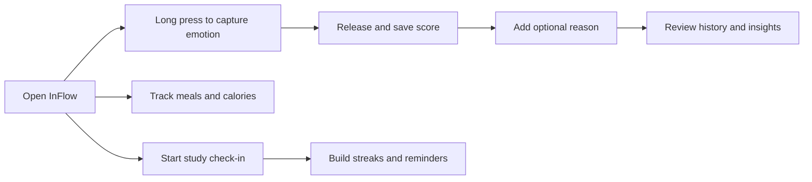

<p align="center">
  
</p>

<h1 align="center">InFlow</h1>

<p align="center">
  <strong>Track your every InFlow moment</strong>
</p>

<p align="center">
  
  
  
  
</p>

## 项目简介

InFlow 是一个面向个人状态管理的 MVP 应用。它从一个很轻的动作开始：长按、感受、释放，把抽象的情绪强度变成可视化的 Emoji、分数和粒子流动。围绕这个核心体验，项目继续加入了情绪历史、饮食热量记录、学习打卡、连续天数统计和邮件提醒等模块，让每一次状态变化都能被记录、回看和理解。

这个版本适合作为一个前端交互 MVP：没有后端数据库，主要数据保存在浏览器 `localStorage` 中；邮件提醒使用 EmailJS，并通过环境变量配置，仓库中不包含真实 API key 或私密配置。

## 功能亮点

| 模块 | 说明 | 体验关键词 |
| --- | --- | --- |
| 情绪长按记录 | 长按按钮将 0-5 秒映射为 0-100 的情绪强度，并实时切换 Emoji | 触觉感、释放感、粒子动画 |
| 情绪历史 | 保存每次情绪记录，可补充原因并查看趋势图 | 复盘、趋势、个人日志 |
| 饮食记录 | 记录三餐、估算热量、查看每日摄入与预算 | 饮食觉察、热量仪表盘 |
| 体重与运动建议 | 根据身体信息计算 BMR/TDEE/BMI，并给出运动建议 | 健康管理、轻量建议 |
| 学习打卡 | 配置每日学习目标、计时、保存进度、展示连续打卡 | 目标感、习惯养成 |
| 邮件提醒 | 通过 EmailJS 发送测试邮件和未打卡提醒 | 可选提醒、环境变量配置 |

## 产品体验



## 视觉风格

InFlow 的界面以深色沉浸背景、柔和渐变、Emoji 视觉反馈和 Canvas 粒子动效为核心。整体更像一次短暂的情绪呼吸练习：按下时能量逐渐积累，松手后状态被保存下来。

> 首页 README 使用白底 `InFlow` 主视觉，方便公开仓库在 GitHub 上清晰展示项目名称和 slogan。

## 技术栈

- React 18
- Vite 5
- CSS Animation
- Canvas API
- localStorage
- EmailJS Browser SDK

## 快速开始

```bash
npm install
npm run dev
```

构建生产版本：

```bash
npm run build
```

本地预览构建产物：

```bash
npm run preview
```

## 环境变量

如需启用邮件提醒，请复制 `.env.example` 为 `.env`，并填入你自己的 EmailJS 配置：

```env
VITE_EMAILJS_PUBLIC_KEY=
VITE_EMAILJS_SERVICE_ID=
VITE_EMAILJS_TEMPLATE_ID=
VITE_EMAILJS_REMINDER_TEMPLATE_ID=
```

这些值不会提交到仓库中。`.gitignore` 已排除 `.env` 和 `.env.*`，只保留安全的 `.env.example` 模板。

## 项目结构

```text
InFlow/
├── docs/
│   └── assets/
│       └── readme-hero.svg
├── src/
│   ├── components/
│   ├── data/
│   ├── hooks/
│   ├── services/
│   ├── utils/
│   ├── App.jsx
│   ├── App.css
│   └── main.jsx
├── .env.example
├── .gitignore
├── package.json
├── SPEC.md
└── vite.config.js
```

## 公开仓库说明

当前仓库只包含适合公开展示的 MVP 内容。以下内容不会被提交：

- `node_modules/`
- `dist/`
- `.claude/`
- `.env`
- `.env.*`
- API key、token、secret 等真实敏感配置

## Roadmap

- 增加更完整的情绪分析维度
- 为饮食识别接入真实模型或 API
- 增加可导出的个人周报
- 增加更细的提醒策略和通知设置
- 为移动端交互继续打磨触控反馈

## License

This MVP currently has no explicit license. Please add one before reusing or redistributing the project.
